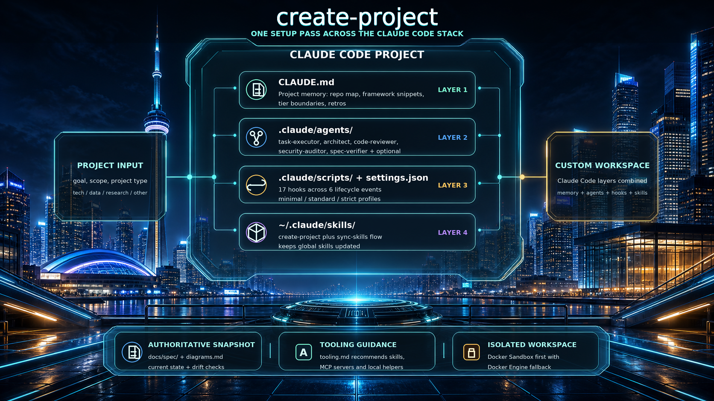
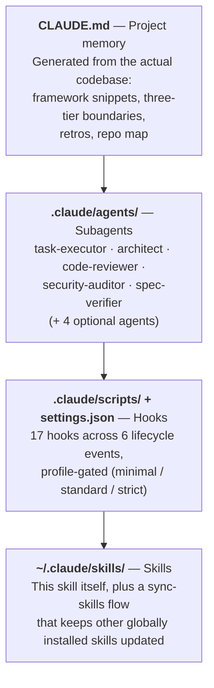

# create-project

A Claude Code skill that scaffolds new projects with opinionated structure, isolated Docker workspaces, and Claude-specific tooling setup.



> **Note:** This skill is a work in progress. If you run into any issues, please [open an issue](https://github.com/tkdtaylor/create-project/issues) on the repo.

## What it does

Triggered by phrases like "start a new project", "scaffold a codebase", "set up a research project", "start a data science project", "sync my skills", "update my skills", or "audit my project". The skill:

1. Interviews you until the goal, scope, and success criteria are unambiguous — confirms a written summary before touching any files
2. Creates a type-matched directory structure with template files, including requirement-traceable task and test spec templates (`REQ-NNN` IDs flow from task → test spec → code)
3. Generates a `CLAUDE.md` so every future session starts with full project context
4. **Technical / Data:** offers to scaffold a minimal runnable starter in `src/` (health endpoint, CLI entrypoint, data pipeline skeleton, etc.)
5. **Research:** offers to run initial web searches and seed `sources/web/` so the project starts with real material; ships output templates (decision brief, deep research report, learning plan) in `outputs/templates/`
6. Optionally initialises git and creates a GitHub repo (with scoped access token for the container)
7. **Technical / Data:** sets up an isolated workspace automatically — Docker Sandbox (`sbx`) when available (microVM with network policies and credential proxy), falling back to Docker Engine (shared base image + project-specific image + per-project named volume) on Linux or CI
8. **Technical / Data:** adds a VS Code devcontainer config when using Docker Engine (skipped with `sbx` — the sandbox is the dev environment)
9. **Technical / Data:** configures code quality tooling — auto-detects the language and sets up linting, formatting, pre-commit hooks, coverage thresholds, and a Makefile with standard targets
10. Ships five agents out of the box: task-executor (TDD workflow with a non-negotiable pre-commit verification gate), architect (design review + ADRs + drift audit + fitness function proposal), code-reviewer (10 structured review perspectives), security-auditor (OWASP Top 10), and spec-verifier (assertion-by-assertion spec adherence check before commit). Optional agent templates ship for Step 3d to install when warranted: qa (read-only test/spec gap classifier), docs-writer (README/docstring/CHANGELOG synthesis), task-planner (feature → scoped tasks), and dependency-auditor (cross-ecosystem dep scanning). Model tiers auto-mapped to the best available model
11. Installs hooks across six lifecycle events, gated by `CLAUDE_HOOK_PROFILE` (minimal/standard/strict): secret file protection, config-protection for linter configs, block-no-verify for git commands, protect-checkout for uncommitted-work preservation, failure-mode retrospective injection at session start, plan-to-tasks restructuring, edit tracking for batch processing, pre-commit spec-coverage enforcement, pre-compact checkpoint enforcement, post-compact context recovery, periodic checkpoint reminders, strategic compaction suggestions, batch format+typecheck, scope-drift summary, smoke-test detection, fitness-function execution (`make fitness`), and desktop notifications
12. Writes a `.claude/skill-manifest.json` that tracks which files came from skill templates, enabling future syncs
13. **Skill sync:** checks globally installed skills for upstream updates (via git pull) and syncs managed project artifacts (hooks, agents, settings) from updated templates — defaults to **intelligent merge over overwrite**, prompts only when a merge can't reconcile, and prints a per-file diff summary so `git diff` is the safety net rather than a wall of confirmation prompts

## Across the Claude Code stack

A Claude Code project can be customized at four layers — project memory, subagents, hooks, and skills. `create-project` deposits artifacts at every layer in a single setup pass, so a project starts the way a mature one looks:



The skill also ships `docs/spec/` + `diagrams.md` as the project's authoritative current-state snapshot, and recommends suitable MCP servers via `tooling.md` — but neither of those is a Claude Code customization layer the skill writes to directly.

## First-time setup

Every project created by this skill includes a `.claude/settings.json` that auto-approves most bash commands inside the container while retaining prompts for destructive operations (`sudo`, `rm -rf`, `git push --force`, etc.). It also configures hooks across six lifecycle events (safety, workflow, formatting, and fitness-function execution), all gated by `CLAUDE_HOOK_PROFILE` environment variable (minimal/standard/strict). No manual configuration needed per project.

If you want the same behaviour on the **host** or in sessions outside a project container, add the same permissions to your global `~/.claude/settings.json`:

```json
{
  "permissions": {
    "allow": ["Bash(*)", "Read", "Write", "Edit", "Glob", "Grep"],
    "ask": [
      "Bash(sudo:*)",
      "Bash(rm -rf:*)",
      "Bash(git push --force:*)",
      "Bash(git push -f:*)",
      "Bash(git reset --hard:*)",
      "Bash(dd :*)",
      "Bash(mkfs:*)"
    ]
  }
}
```

---

## Dependencies

### Required

**Claude Code**
The skill runs inside Claude Code. Install it via npm or the desktop app:
```bash
npm install -g @anthropic-ai/claude-code
```
→ https://docs.anthropic.com/en/docs/claude-code

---

### For isolated workspaces (steps T6/D6/R6)

The skill checks for isolation tools in this order: **Docker Sandbox (`sbx`)** first, then **Docker Engine** as fallback. If neither is found, the isolation step is skipped.

**Docker Sandbox (`sbx`)** *(recommended for macOS / Windows)*
Runs Claude Code in a microVM with its own kernel — stronger isolation than containers, with built-in network policies and credential management via OS keychain. No Dockerfiles, no volumes, no compose files.

```bash
# Mac (Apple Silicon)
brew install docker/tap/sbx
sbx login

# Windows 11
winget install -h Docker.sbx
sbx login
```
→ https://docs.docker.com/ai/sandboxes/

**Docker Engine** *(fallback — required for Linux, CI, or when sbx is not available)*
Docker Compose is optional — the skill detects whether `docker compose` (v2 plugin) or `docker-compose` (v1 standalone) is available and writes commands accordingly. If neither is installed, it falls back to plain `docker run` commands.

- **Mac / Windows:** Install Docker Desktop → https://www.docker.com/products/docker-desktop
- **Linux:** Install Docker Engine (Compose plugin optional but recommended):
  ```bash
  # Debian / Ubuntu
  curl -fsSL https://get.docker.com | sh
  sudo apt-get install docker-compose-plugin   # optional
  sudo usermod -aG docker $USER   # log out and back in after this
  ```
  → https://docs.docker.com/engine/install/

---

### For GitHub repo creation (steps T5/D5/R5)

**GitHub CLI (`gh`)**
Optional. If installed, the skill can create the GitHub repository and configure the remote automatically. Without it, the skill gives manual instructions instead.

```bash
# Mac
brew install gh

# Linux (Debian / Ubuntu)
sudo apt install gh

# Windows
winget install GitHub.cli
```
→ https://cli.github.com

After installing, authenticate:
```bash
gh auth login
```

**Note on tokens:** The skill does not attempt to generate a personal access token programmatically — it guides you through creating a fine-grained PAT manually at https://github.com/settings/personal-access-tokens/new. The `gh api` approach for PAT generation requires an extra auth scope that usually isn't granted and fails silently more often than it works.

---

### For VS Code IDE integration (steps T7/D7/R7 — Docker Engine only)

**VS Code Dev Containers extension**
Optional. Only applies when using the Docker Engine path — skipped when Docker Sandbox (`sbx`) is configured. Lets you open the project directly inside the Docker container — your editor, terminal, and Claude Code all run in the isolated workspace.

Install from VS Code Extensions panel: search **Dev Containers** (publisher: Microsoft)
or:
```bash
code --install-extension ms-vscode-remote.remote-containers
```
→ https://marketplace.visualstudio.com/items?itemName=ms-vscode-remote.remote-containers

---

## Project types

| Type | Use when | Key structure |
|------|----------|---------------|
| **technical** | Building software — APIs, CLIs, scripts, automation | `src/`, `artifacts/`, `docs/spec/` (authoritative current-state snapshot incl. `architecture.md` C4 element catalog and `fitness-functions.md` executable invariants), `docs/architecture/` (overview, C4 Mermaid diagrams, ADRs), `docs/tasks/` with TDD scaffolding (test specs before tasks) |
| **data** | Data science or machine learning — model training, data pipelines, analytics, experiment-driven work | `data/`, `notebooks/`, `src/`, `experiments/` (with structured sandbox template), `models/`, `tests/`, `docs/spec/` (pipeline + reproducibility contract incl. `architecture.md` C4 catalog with datasets and `fitness-functions.md` executable reproducibility/integrity invariants), `docs/architecture/` (overview, C4 Mermaid + lineage diagrams, ADRs), with dual TDD + experiment tracking |
| **research** | Synthesising information — literature reviews, competitive analysis, report writing | `sources/`, `notes/`, `outputs/` (with decision brief, deep research, and learning plan templates), `docs/` |
| **other** | Planning, tracking, organising — wedding planning, job search, project management | Research base structure with domain-specific top-level folders (e.g. `vendors/`, `budget/`, `timeline/`) chosen by the user |

## Isolation architecture

The skill supports two isolation backends. It detects what's available and picks the stronger option automatically.

### Docker Sandbox (`sbx`) — preferred

Available on macOS (Apple Silicon) and Windows 11. Each sandbox is a **microVM** with its own Linux kernel — not just namespace isolation. The agent runs with `--dangerously-skip-permissions` by default because the blast radius is contained within a disposable VM.

| Aspect | How it works |
|--------|-------------|
| **Isolation** | Dedicated kernel, filesystem, and Docker daemon per sandbox |
| **Network** | Configurable allow/deny lists per domain (balanced policy recommended) |
| **Credentials** | Stored in OS keychain, injected via proxy — never inside the sandbox |
| **Workspace** | Host directory mounted into the VM; changes persist on host |
| **Branches** | Built-in `--branch` mode creates Git worktrees under `.sbx/` |
| **Setup** | Zero config — `sbx run claude .` and go |

### Docker Engine — fallback

Used on Linux, in CI, or when `sbx` is not installed. Provides container-level isolation with a custom Docker setup.

#### Security model

| | Container sees | Can write |
|---|---|---|
| `/app` or `/workspace` | Named volume — project workspace | Yes |
| `/host` | Host project root (bind mount) | No — read-only |
| `/app/.env` | Host `.env` file (bind mount) | Yes |
| `~/.claude/` | Host Claude Code config directory (bind mount) | Yes — writable so Claude can refresh tokens and write session state |
| Everything else on host | Nothing | — |

The container runs as a non-root `developer` user. The entrypoint performs privileged init steps as root then drops to `developer` via `gosu` before starting the shell. This means Claude Code cannot install system packages, modify OS config, or escalate privileges.

#### Shared base images

Built once per machine, reused across all projects of that type:

| Image | Contents |
|-------|----------|
| `claude-project-dev:latest` | debian:bookworm-slim + git + Python + Node + Claude Code |
| `claude-project-research:latest` | same + pandoc + poppler-utils + Python research libs |

The skill stores a `sha256` hash of each Dockerfile as a Docker label and rebuilds automatically when the content changes. To update (e.g. pin a Claude Code version), edit `assets/base/tech.Dockerfile` — the next project setup detects the hash change and rebuilds.

#### Per-project (created in seconds)

- Named Docker volume (`<project-name>-workspace`) — the container's isolated, persistent workspace
- `docker/Dockerfile` extending the shared base with the project's runtime (Rust, Go, etc.) and a uid/gid fix so bind-mounted host files are accessible
- `docker/docker-compose.yml` building from the project Dockerfile, with all required volume and credential mounts
- `.env` with API keys and git credentials (gitignored) — `GIT_USER_NAME` and `GIT_USER_EMAIL` pre-filled from host git config if set
- `.devcontainer/devcontainer.json` for VS Code — created automatically

#### Entrypoint behaviour (runs on every `docker compose run`)

1. Volume empty → copy project files from `/host` into volume + `chown` to `developer`
2. `requirements.txt` present + `.venv` missing or hash changed → create/update venv + `pip install`
3. `.venv` broken after base image update → auto-recreate
4. Export `VIRTUAL_ENV` and `PATH` for venv activation
5. Configure git identity and credential helper from env vars (`GIT_USER_NAME`, `GIT_USER_EMAIL`, `GIT_TOKEN`) — token is never written to disk
6. Drop privileges → `exec gosu developer "$@"`

#### VS Code workflow

```
open project folder in VS Code
  → Dev Containers: Reopen in Container
    → entrypoint seeds volume + installs deps (first open only)
      → VS Code connects as developer user to /app or /workspace
        → Claude Code, terminal, language servers all run inside the container
```

## Repo structure

```
assets/
  base/                          # Shared Docker base images — managed by the skill
    tech.Dockerfile
    tech-entrypoint.sh           # init + gosu privilege drop
    research.Dockerfile
    research-entrypoint.sh
  templates/
    common/                      # Hook scripts and shared starters used across all project types
      agent-rules.md             # starter retro log — worktree, smoke-test, dead-code, git checkout failure modes (tech/data only — paired with inject-retros.py)
      scripts/
        check-task-state.sh      # invariant check: each NNN-*.md task in exactly one of {backlog, active, completed} (all types)
        verify-worktree-isolation.sh # post-dispatch audit: confirms parallel agents respected isolation: "worktree" (tech/data only)
      .claude/scripts/
        _hook_utils.py           # shared profile gating module (minimal/standard/strict)
        protect-secrets.py       # blocks writes to private keys and credential files
        block-no-verify.py       # blocks --no-verify on git commands
        restructure-plan.py      # splits plans into task files on exit from plan mode
        pre-compact.py           # blocks compaction until uncommitted changes are saved
        post-compact.py          # re-injects task context after context compaction
        periodic-checkpoint.py   # reminds agent to commit every N turns
        strategic-compact.py     # suggests /compact at task boundaries
        desktop-notify.py        # OS notification on completion (strict profile)
        inject-retros.py         # SessionStart — surfaces relevant Failure-mode entries from agent-rules.md
    tech/                        # Per-project templates — technical projects
      CLAUDE.md
      devcontainer.json
      diagrams.md                # C4 Mermaid (Context/Container/Component) + sequence flows (part of authoritative spec)
      spec/                      # Authoritative current-state snapshot — see SPEC.md
        SPEC.md
        behaviors.md             # what the system does
        architecture.md          # C4 element catalog (paired with diagrams.md)
        data-model.md            # entities, schemas, state, wire formats
        interfaces.md            # CLI / API / public surfaces
        configuration.md         # env vars, configs, runtime knobs
        fitness-functions.md     # executable architectural invariants (run via `make fitness`)
      RELEASE_CHECKLIST.md       # conditional — pre-tag verification gate, copied only for projects that ship versioned releases
      CONTRIBUTING.md            # conditional — public/internal contributor guide; renamed to HANDOVER.md for private projects
      .claude/
        settings.json            # permissions + hooks across six lifecycle events (PreToolUse, PostToolUse, SessionStart, PreCompact, PostCompact, Stop)
        scripts/
          config-protection.py   # blocks modifications to linter/formatter configs
          protect-checkout.py    # blocks `git checkout -- <path>` over a dirty tree
          edit-tracker.py        # accumulates edited files for batch processing
          batch-format-typecheck.py  # batch format+typecheck at Stop (strict profile)
          spec-coverage-check.py # blocks `git commit` if active task's TC markers have no test references
          scope-drift-summary.py # Stop — one-line diff vs spec coverage summary
          detect-smoke-tests.py  # Stop — flags tests in diff with no assertions
          check-fitness.py       # Stop — runs `make fitness` if defined (strict profile, warn-only)
        agents/
          task-executor.md       # ephemeral agent for executing one task at a time (incl. pre-commit verification gate)
          architect.md           # design review + ADR drafting + drift audit + fitness-function proposal (tier: deep)
          code-reviewer.md       # structured multi-perspective code review (tier: balanced)
          security-auditor.md    # OWASP Top 10 application security audit (tier: deep)
          spec-verifier.md       # assertion-by-assertion spec adherence check before commit (tier: balanced)
          # optional templates picked in Step 3d:
          qa.md                  # read-only test-suite verification + spec/test gap classification (tier: balanced)
          docs-writer.md         # README / docstring / CHANGELOG synthesis from code + spec (tier: fast)
          task-planner.md        # feature → scoped tasks with paired test specs (tier: balanced)
          dependency-auditor.md  # cross-ecosystem dep scanning (tier: balanced)
      docker/
        Dockerfile               # extends shared base with project runtime + uid fix
        docker-compose.yml       # builds project image, mounts volume + credentials
        .env.example             # documents all required env vars including git creds
        requirements.txt
      [architecture, task, roadmap templates...]
    data/                        # Per-project templates — data / ML projects
      CLAUDE.md
      devcontainer.json
      diagrams.md                # C4 Mermaid (Context/Container/Component) + lineage + sequence flows (part of authoritative spec)
      spec/                      # Authoritative current-state snapshot — see SPEC.md
        SPEC.md
        behaviors.md             # pipeline behaviors (training, eval, inference)
        architecture.md          # C4 element catalog + datasets (paired with diagrams.md)
        data-model.md            # datasets, features, model artifacts, results schema
        interfaces.md            # CLI runners, notebook entrypoints, public src/ API
        configuration.md         # experiment configs, env vars, metrics catalog
        fitness-functions.md     # executable invariants — reproducibility, raw-data immutability, perf budgets
      .claude/                   # settings + agents (hooks from common/ + tech/; optional templates: qa.md, docs-writer.md, task-planner.md). Scripts and agent-rules.md come from common/.
      docker/                    # same Docker pattern as tech
      experiment-tracker.md      # tracks experiment runs alongside coverage-tracker
      experiments/
        EXPERIMENT-TEMPLATE.md   # structured sandbox for exploratory research
      [architecture, task, roadmap templates...]
    research/                    # Per-project templates — research projects
      CLAUDE.md
      devcontainer.json
      decision-brief-template.md # structured comparison + recommendation output template
      deep-research-template.md  # in-depth research report output template
      learning-plan-template.md  # three-phase learning syllabus output template
      .claude/                   # settings + task-executor agent (hooks + check-task-state.sh come from common/)
      docker/
        docker-compose.yml
        .env.example
        requirements.txt         # pre-populated with requests, bs4, pdfminer, markdownify
      [outline, task, research-log templates...]
references/
  tech-project.md                # Step-by-step setup for technical projects (T1–T8)
  data-project.md                # Step-by-step setup for data / ML projects (D1–D8)
  research-project.md            # Step-by-step setup for research / other projects (R1–R7)
  adopt-existing.md              # Adopting an existing codebase (A1–A9, with sub-steps A4b/A4c, then Step 3 of the main flow for tooling + manifest)
  sync-skills.md                 # Syncing skills and project artifacts (S1–S5)
  audit-project.md               # Project-wide audit dispatcher (5 layers — inventory, hooks, drift, fitness, README)
  tooling.md                     # Skills, hooks, agents, MCP servers, and CLI tools catalog with project-type matching
  framework-snippets.md          # Framework-specific CLAUDE.md convention snippets (Next.js, Supabase, Go, etc.)
  fitness-functions.md           # Per-stack catalog of fitness-function tools (import-linter, dep-cruiser, ArchUnit, k6, etc.)
evals/
  evals.json                     # Test cases and assertions for skill evaluation
SKILL.md                         # Entry point — gathers info, routes to reference files
README.md                        # This file
```

## Installing / updating

The skill is developed here and installed to `~/.claude/skills/create-project/`.

**Option A — Clone (recommended).** Cloning preserves the `.git` directory, which lets the sync flow (`"sync my skills"`) automatically pull upstream updates via `git pull`:

```bash
git clone https://github.com/tkdtaylor/create-project.git ~/.claude/skills/create-project
```

**Option B — Copy.** Works, but the sync flow won't be able to auto-update the global install (it will prompt you to reinstall manually):

```bash
rm -rf ~/.claude/skills/create-project && cp -r /path/to/create-project ~/.claude/skills/create-project
```

The installed directory name must match the `name:` field in `SKILL.md` (`create-project`).

## Syncing skills and upgrading existing projects

Projects created with an older version of this skill won't automatically get new features (hooks, agents, boundaries, etc.). The skill includes a **sync flow** that checks for upstream changes and merges them into your project while preserving local customizations.

### Automatic sync (recommended)

Open Claude Code in your project and say:

- *"sync my skills"*
- *"update my skills"*
- *"make sure my skills are up to date"*

The sync flow does two things:

1. **Updates globally installed skills** — for each skill in `~/.claude/skills/` that is a git repo, fetches and fast-forward pulls upstream changes
2. **Syncs project artifacts** — compares your project's managed files (hooks, agents, settings) against the latest templates using `.claude/skill-manifest.json`, then:
   - **Applies upstream-only changes** when the manifest confirms you haven't touched the file
   - **Preserves** your local customizations when the template hasn't changed
   - **Intelligently merges** when both sides changed (or when there is no manifest to consult) — preserves your edits, applies the upstream improvements, and only prompts if a region genuinely can't be reconciled
   - **Offers new files** added to the skill since your project was set up
   - **Reports a per-file diff summary** at the end so you can review with `git diff HEAD~1` (or back out the entire sync with `git reset --hard HEAD~1`)

Agent files get special handling inside the merge: the `model:` field from your project is always preserved so your model tier configuration isn't lost.

### Manifest tracking

Projects set up with the current version of the skill include `.claude/skill-manifest.json`, which records sha256 hashes of each managed file at install time. This enables precise three-way change detection during sync.

Projects set up before manifest tracking was added still sync safely — they enter **first-sync mode**: because the sync can't tell which files you may have edited, it runs an intelligent merge against every divergent file rather than overwriting, then writes the manifest from post-merge hashes so subsequent syncs can use precise classification. Nothing gets clobbered just because no manifest exists yet.

### Manual upgrade (alternative)

If you prefer to update files manually, managed files live across two template directories:

- **Universal hooks** (all project types): `assets/templates/common/.claude/scripts/`
- **Type-specific files**: `assets/templates/<type>/` (where `<type>` is `tech`, `data`, or `research`)
- **Tech-only hooks** (also used by data): `assets/templates/tech/.claude/scripts/`

| File | Source | What it adds |
|------|--------|-------------|
| `.claude/settings.json` | `<type>/` | Permissions + 17 hooks with profile gating |
| `.claude/scripts/_hook_utils.py` | `common/` | Shared profile gating module |
| `.claude/scripts/protect-secrets.py` | `common/` | Blocks writes to private keys and credential files |
| `.claude/scripts/block-no-verify.py` | `common/` | Blocks --no-verify on git commands |
| `.claude/scripts/restructure-plan.py` | `common/` | Plan-to-tasks hook on exit from plan mode |
| `.claude/scripts/pre-compact.py` | `common/` | Blocks compaction until uncommitted changes are saved |
| `.claude/scripts/post-compact.py` | `common/` | Re-injects task context after context compaction |
| `.claude/scripts/periodic-checkpoint.py` | `common/` | Reminds agent to commit every N turns |
| `.claude/scripts/strategic-compact.py` | `common/` | Suggests /compact at task boundaries |
| `.claude/scripts/desktop-notify.py` | `common/` | OS notification on completion (strict profile) |
| `.claude/scripts/inject-retros.py` | `common/` | SessionStart — surfaces relevant Failure-mode entries from CLAUDE.md |
| `.claude/scripts/config-protection.py` | `tech/` | Blocks linter/formatter config edits (tech/data only) |
| `.claude/scripts/protect-checkout.py` | `tech/` | Blocks `git checkout … -- <path>` over a dirty working tree (tech/data only) |
| `.claude/scripts/edit-tracker.py` | `tech/` | Accumulates edited files for batch processing (tech/data only) |
| `.claude/scripts/batch-format-typecheck.py` | `tech/` | Batch format+typecheck at Stop (tech/data only) |
| `.claude/scripts/spec-coverage-check.py` | `tech/` | Pre-commit — blocks `git commit` if active task's TC markers have no test references (tech/data only) |
| `.claude/scripts/scope-drift-summary.py` | `tech/` | Stop — prints one-line summary of diff vs spec coverage (tech/data only) |
| `.claude/scripts/detect-smoke-tests.py` | `tech/` | Stop — flags tests in current diff with no assertion / panic / expect (tech/data only) |
| `.claude/scripts/check-fitness.py` | `tech/` | Stop — runs `make fitness` if defined; warn-only (tech/data only, strict profile) |
| `.claude/agents/task-executor.md` | `<type>/` | Ephemeral agent for executing one task at a time |
| `.claude/agents/architect.md` | `<type>/` | Architecture review + ADR drafting (tech/data only) |
| `.claude/agents/code-reviewer.md` | `<type>/` | Structured multi-perspective code review (tech/data only) |
| `.claude/agents/security-auditor.md` | `<type>/` | OWASP Top 10 application security audit (tech/data only) |
| `.claude/agents/spec-verifier.md` | `<type>/` | Assertion-by-assertion spec adherence check before commit (tech/data only) |
| `.claude/agents/qa.md` | `<type>/` | *(optional)* Read-only test-suite verification + spec/test/smoke gap classification (tech/data only) |
| `.claude/agents/docs-writer.md` | `<type>/` | *(optional)* README / docstring / CHANGELOG synthesis from code + spec (tech/data only) |
| `.claude/agents/task-planner.md` | `<type>/` | *(optional)* Feature breakdown into scoped tasks with paired test specs (tech/data only) |
| `.claude/agents/dependency-auditor.md` | `tech/` | *(optional)* Cross-ecosystem dep scanning across Cargo / npm / PyPI / Go (tech only; data projects pull from tech/) |
| `scripts/check-task-state.sh` | `common/scripts/` | Invariant check: each `NNN-*.md` task tracked in exactly one of `{backlog, active, completed}` (mode 755) |
| `scripts/verify-worktree-isolation.sh` | `common/scripts/` | Post-dispatch audit confirming parallel agents respected `isolation: "worktree"` (tech/data only, mode 755) |
| `docs/architecture/agent-rules.md` | `common/agent-rules.md` | Starter retro log paired with the `inject-retros.py` SessionStart hook (tech/data only) |

Quick copy for a tech project (run from your project root):

```bash
SKILL=~/.claude/skills/create-project/assets/templates
mkdir -p .claude/scripts .claude/agents scripts docs/architecture
cp "$SKILL/tech/.claude/settings.json" .claude/settings.json
cp "$SKILL/common/.claude/scripts/"*.py .claude/scripts/
cp "$SKILL/tech/.claude/scripts/"*.py .claude/scripts/
cp "$SKILL/tech/.claude/agents/"*.md .claude/agents/
cp "$SKILL/common/scripts/"*.sh scripts/ && chmod +x scripts/*.sh
[ -f docs/architecture/agent-rules.md ] || cp "$SKILL/common/agent-rules.md" docs/architecture/agent-rules.md
```

For data projects, replace `tech` with `data` for `.claude/agents/` and `.claude/settings.json` (everything else comes from `common/` already). For research projects, skip the tech `.claude/scripts/` and `.claude/agents/` lines, and skip the `agent-rules.md` line — the only common-script research needs is `check-task-state.sh`.

### Updating CLAUDE.md

`CLAUDE.md` is not a managed file (it has project-specific content), so the sync flow does not touch it. If the templates have added new sections (commit rules, three-tier boundaries, anti-rationalization tables, plan mode), you can either:
- Manually add the missing sections to your existing `CLAUDE.md` (look at the current template in `assets/templates/<type>/CLAUDE.md` for the format)
- Or regenerate `CLAUDE.md` from the template and merge with your project-specific content

### Updating Docker mounts

If your project was created before the `~/.claude/` writable mount fix, update your Docker config:

**devcontainer.json** — replace individual read-only mounts:
```jsonc
// Old (broken — Claude can't refresh tokens)
"source=${localEnv:HOME}/.claude/settings.json,target=/home/developer/.claude/settings.json,type=bind,readonly=true",
"source=${localEnv:HOME}/.claude/.credentials.json,target=/home/developer/.claude/.credentials.json,type=bind,readonly=true"

// New (working)
"source=${localEnv:HOME}/.claude,target=/home/developer/.claude,type=bind"
```

**docker-compose.yml** — same change in the volumes section.

## Auditing a project after a round of tasks

When a batch of tasks finishes (or before tagging a release), say *"audit my project"*, *"drift check"*, or *"are docs up to date"*. The skill dispatches five focused read-only sub-agents against the working tree (worktrees would hide uncommitted edits — exactly what the audit needs to see):

| Layer | What it checks |
|-------|---------------|
| 1. Inventory + cross-refs | Every file referenced in tables/manifests exists; markdown links resolve; TC markers in spec map to test files |
| 2. Hook wiring + stale numbers | Every script in `.claude/scripts/` is wired in `settings.json` (no orphans, no broken refs); cited numbers in prose ("17 hooks", "5 agents") match reality |
| 3. Spec drift | Architect agent's drift-audit mode — `docs/spec/` and `diagrams.md` still describe the actual code |
| 4. Fitness rows ↔ Make targets | Every `F-NNN` row in `fitness-functions.md` has a `fitness-<id>` Make target, and vice versa |
| 5. README freshness | After 1–4, verifies the README's claims (feature list, install commands, examples) still match reality, with prior findings as context |

The audit aggregates findings into must-fix / should-fix / probably-fine and offers to apply the first two batches in a single pass — leaving the working tree dirty for you to review before committing. It is read-only by default; nothing is changed without your confirmation.

## Adding to an existing codebase

The skill can adopt existing codebases — not just scaffold new ones. Open Claude Code in an existing project directory and say *"set up this project for Claude"*, *"add project structure"*, or *"onboard this repo"*.

The skill will:

1. **Analyze the codebase** — detect the stack, read the directory structure, discover build/test/run commands, review git history and conventions
2. **Confirm understanding** — present a summary and ask you to verify before writing anything
3. **Generate `CLAUDE.md`** — a project context file based on the *actual* code, not generic templates. Includes real commands, real structure, real conventions discovered from the codebase
4. **Generate `docs/architecture/overview.md`** — component map, data flow, key dependencies, entry points — all derived from reading the code
5. **Generate `docs/architecture/diagrams.md`** *(tech / data)* — C4-structured Mermaid (Context → Container → Component → sequence; data projects also get end-to-end lineage), populated from the actual modules, deployable units, and import graph
6. **Generate `docs/spec/`** *(tech / data)* — seven-file authoritative snapshot: SPEC.md, behaviors.md, architecture.md (the tabular C4 element catalog paired with the diagrams), data-model.md, interfaces.md, configuration.md, fitness-functions.md (executable architectural invariants — for data projects this includes the reproducibility contract), all populated from the code with explicit TODOs flagged where the code is ambiguous
7. **Create task structure** — `docs/tasks/active/`, `backlog/`, `completed/`, and test-spec tracking so plan mode and the task-executor work
8. **Copy hooks and agents** — settings.json, hook scripts, and agent templates (task-executor, architect, code-reviewer, security-auditor for tech/data projects)
9. **Configure model tiers** — detect available models and set the best one for each agent
10. **Recommend tooling** — skills, hooks, and CLI tools suited to the project
11. **Write skill manifest** — records which files came from templates in `.claude/skill-manifest.json`, enabling future syncs

Existing source code is never moved, renamed, or restructured. The skill adds a documentation and tooling layer alongside what's already there.

## Updating the base Docker images

Edit the relevant Dockerfile in `assets/base/` then sync the skill. The next time `create-project` runs the Docker setup step it detects the hash change and rebuilds. Existing project volumes are unaffected — the new image is used on the next `docker compose run`.

Example — pin a specific Claude Code version:
```dockerfile
# assets/base/tech.Dockerfile
RUN npm install -g @anthropic-ai/claude-code@1.x.x
```

## Acknowledgments

The plan mode optimization (context-saving skeleton + ephemeral task executor) is adapted from [plan-plus](https://github.com/RandyHaylor/plan-plus) by Randy Haylor. The original splits plans into step files and uses lightweight skeletons to reduce context token usage. This skill adapts that approach to work within its opinionated task structure, TDD workflow, and commit conventions.

The post-compact context recovery hook and protect-secrets hook are adapted from [claudeframework](https://github.com/dixus/claudeframework) by Holger Kreissl. The task-executor's self-review step before committing is also inspired by their pre-flight review pattern.

The three-tier boundary system (Always / Ask First / Never) and anti-rationalization tables in the CLAUDE.md template are adapted from [agent-skills](https://github.com/addyosmani/agent-skills) by Addy Osmani.

The structured code review perspectives (10 review dimensions with selective application), research output templates (decision brief, deep research report, learning plan), and the approach to auto-configuring code quality tooling (per-language linting, formatting, pre-commit hooks, coverage thresholds) are inspired by [claude-coding-commands](https://github.com/awood45/claude-coding-commands) by Alex Wood.

The hook profile gating system, block-no-verify hook, config-protection hook, batch format+typecheck pattern (accumulate edits then process at Stop), desktop notification hook, strategic compaction suggestions, framework-specific CLAUDE.md snippets, expanded MCP server catalog, and language-specific code reviewer agent templates are inspired by [everything-claude-code](https://github.com/affaan-m/everything-claude-code) by Affaan Mustafa.
