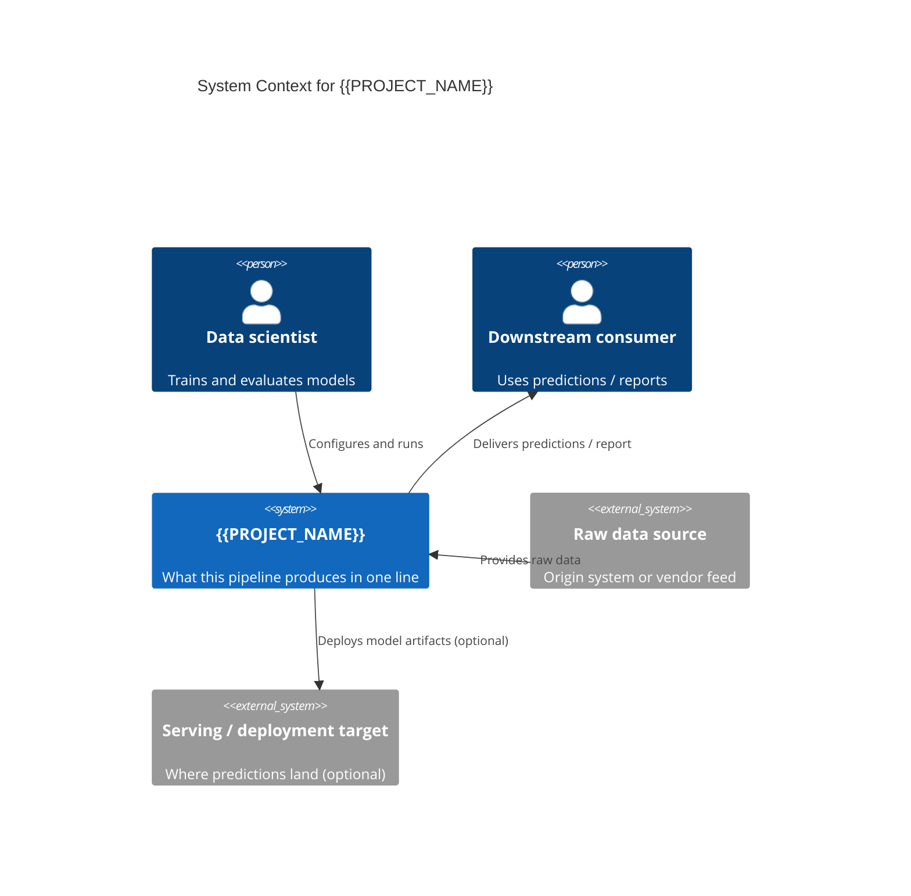
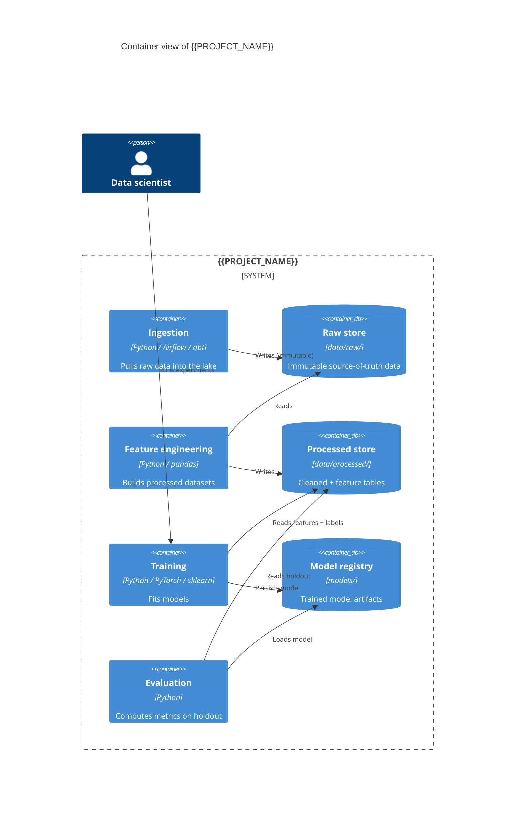
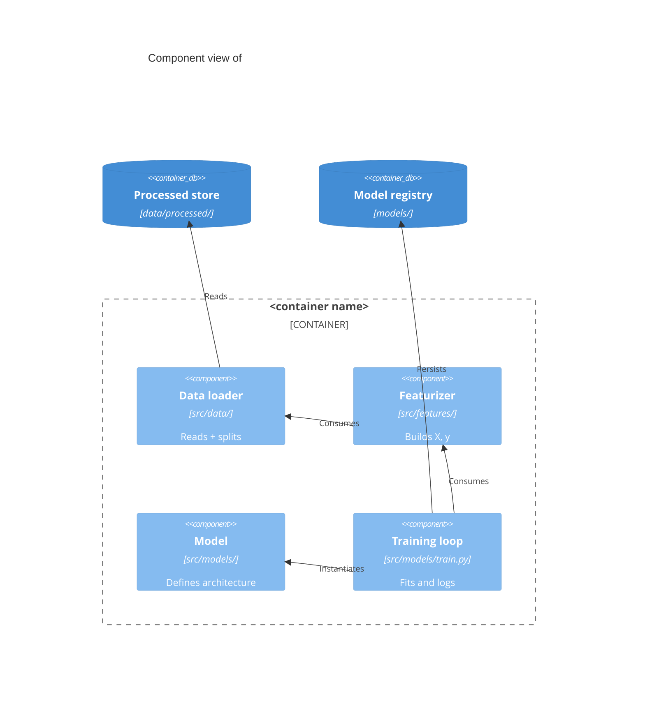
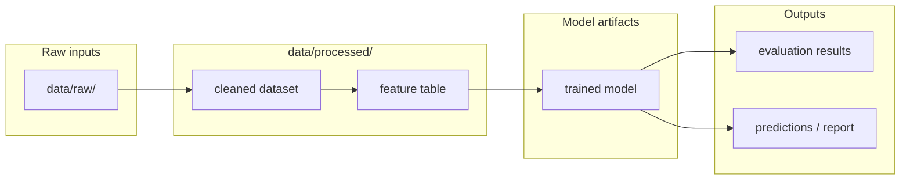
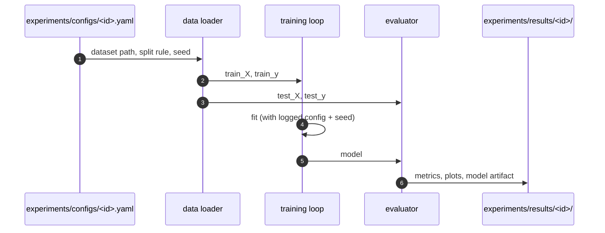

# Architecture Diagrams

**Project:** {{PROJECT_NAME}}
**Last updated:** {{DATE}}

C4-structured Mermaid diagrams (Context → Container → Component) for the pipeline, plus end-to-end data lineage and per-stage runtime flows. See [overview.md](overview.md) for prose context, [decisions/](decisions/) for the ADRs referenced here, and [`../spec/architecture.md`](../spec/architecture.md) for the structured element catalog these diagrams render.

These diagrams are part of the **authoritative spec** for this project. They are not just documentation — they are a source-of-truth statement of how data moves and how the pipeline is arranged. Code changes that contradict a diagram either invalidate the change or invalidate the diagram; one must be updated to match the other in the same commit.

GitHub and most IDE markdown previewers render Mermaid natively — no build step required.

> **Mermaid that renders on GitHub.** A few editor-valid patterns make GitHub's renderer fail with *"Unable to render rich display — Parse error on line N"*. Avoid them — or run `python3 scripts/check-mermaid.py` to catch them before you commit:
> - **No `;` inside a label / message / note** — Mermaid reads it as a statement separator. Use `,` or ` and `. (A `;` *inside double quotes* is fine.)
> - **Don't name a participant with a reserved word** — `box`, `note`, `end`, `loop`, `alt`, `opt`, `par`, `rect`, `critical`, `break`, `activate`, `deactivate`, `over`, `link`, `title`, `actor`. Give it a distinct id and an `as` alias.
> - **No HTML entities** (`&lt;`, `&gt;`, `&amp;`) in labels — the trailing `;` breaks parsing. Write plain text.
> - **Quote edge labels containing parentheses or operators**: `-->|"Some(a) == b"|`.
> - **`%%` comments must be on their own line** — never inline after a statement.

> **Scaling rule.** Single-script analysis projects can skip Section 2 (Containers) and go straight from Context to Lineage. Multi-service ML platforms might split Component into per-container diagrams (3a, 3b, …). Use as many C4 levels as the system actually needs — but always include the lineage diagram (Section 4); it is the one a new contributor needs first.

---

## 1. System Context — who and what feeds the pipeline

> Top-level view: the pipeline as one box, the people who run / consume it, and the external data sources and systems it integrates with. No internals.

---

## 2. Containers — pipeline stages and stores

> One level down: each runnable stage (ingestion, feature engineering, training, evaluation, inference) and each persistent store (raw lake, processed warehouse, model registry, experiment tracker). Show technology and the format on each edge.

---

## 3. Components — modules inside a container

> Drill into the container most worth zooming into (usually training or feature engineering). Show the modules and their dependencies. Add per-container Component diagrams (3a, 3b, …) only when the container has non-trivial internal structure.

---

## 4. End-to-end data lineage

> Full path from raw inputs to final outputs (models, reports, predictions). Includes intermediate storage and the transformation steps between them. This is the diagram a new contributor needs first.

**Key contracts**
- Replace with the load-bearing rules: which datasets are immutable, what schemas are stable, what the train/test split rule is, how seeds propagate, etc.

---

## 5. Training pipeline

> The training loop in detail: config → load → split → fit → evaluate → save. Include CV / hyperparameter search if the project does either.

---

## Adding more diagrams

Add additional numbered sections (6., 7., …) for any of:

- **Inference / serving flow** — if the project serves predictions (batch or online)
- **Feature engineering DAG** — if features have non-trivial dependencies
- **Experiment comparison flow** — how multiple experiment runs are ranked / selected
- **External data ingestion** — how raw data is acquired, validated, and admitted to `data/raw/`

One concept per diagram. If a diagram tries to show both pipeline structure and a specific runtime sequence, split it.

---

## Maintaining these diagrams

- **Trigger to update:** any time a pipeline step is added, removed, or reordered; a dataset shape changes; a new external source appears; an ADR changes a diagrammed flow. Keep [`../spec/architecture.md`](../spec/architecture.md) in sync — the catalog and these diagrams describe the same elements.
- **Edit existing over adding new.** Duplicates rot independently. Split a diagram only when extracting a self-contained subflow makes both clearer.
- **Note ADRs that don't change diagrams.** When an ADR adjusts hyperparameters, defaults, or evaluation metrics without changing the pipeline shape, add a one-line note here so future contributors don't re-ask "should this have been drawn?"
- **Update the date at the top** when you change anything substantive.
