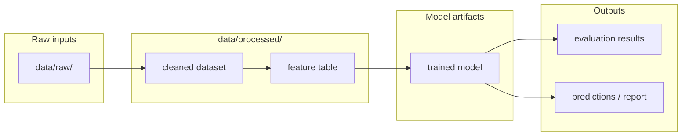
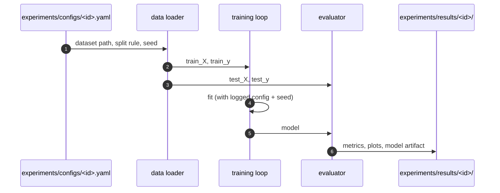

# Architecture Diagrams

**Project:** {{PROJECT_NAME}}
**Last updated:** {{DATE}}

Mermaid diagrams for the data flow and key processing pipelines. See [overview.md](overview.md) for prose context and [decisions/](decisions/) for the ADRs referenced here.

These diagrams are part of the **authoritative spec** for this project. They are not just documentation about the code — they are a source-of-truth statement of how data moves and how components are arranged. Code changes that contradict a diagram either invalidate the change or invalidate the diagram; one must be updated to match the other in the same commit.

GitHub and most IDE markdown previewers render Mermaid natively — no build step required.

---

## 1. End-to-end data lineage

> Replace this block with a `flowchart` showing the full path from raw data to final outputs (models, reports, predictions). Include intermediate storage (`data/processed/`, feature stores) and the transformation steps between them. This is the diagram a new contributor needs first.

**Key contracts**
- Replace with the load-bearing rules: which datasets are immutable, what schemas are stable, what the train/test split rule is, how seeds propagate, etc.

---

## 2. Training pipeline

> Replace this block with a `sequenceDiagram` (or another `flowchart`) for the training loop. Show config → data load → split → fit → evaluate → save. If the project does hyperparameter search or cross-validation, include those.

---

## Adding more diagrams

Add additional numbered sections (3., 4., …) for any of:

- **Inference / serving flow** — if the project serves predictions (batch or online)
- **Feature engineering DAG** — if features have non-trivial dependencies
- **Experiment comparison flow** — how multiple experiment runs are ranked / selected
- **External data ingestion** — how raw data is acquired, validated, and admitted to `data/raw/`

One concept per diagram. If a diagram tries to show both pipeline structure and a specific runtime sequence, split it.

---

## Maintaining these diagrams

- **Trigger to update:** any time a pipeline step is added, removed, or reordered; a dataset shape changes; an ADR changes a diagrammed flow. The "Key decisions" table in [overview.md](overview.md) is the trigger list.
- **Edit existing over adding new.** Duplicates rot independently. Split a diagram only when extracting a self-contained subflow makes both clearer.
- **Note ADRs that don't change diagrams.** When an ADR adjusts hyperparameters, defaults, or evaluation metrics without changing the pipeline shape, add a one-line note here so future contributors don't re-ask "should this have been drawn?"
- **Update the date at the top** when you change anything substantive.
