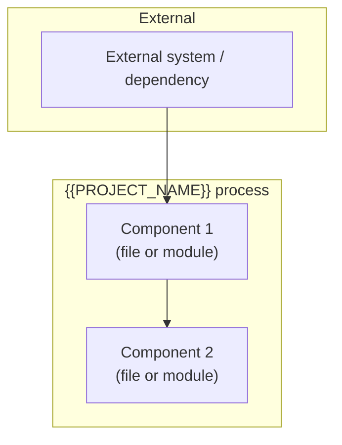
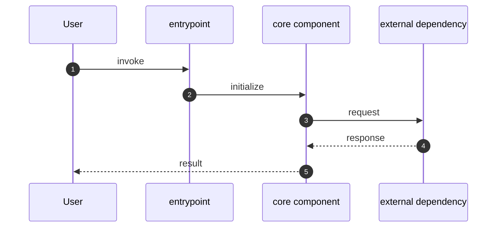

# Architecture Diagrams

**Project:** {{PROJECT_NAME}}
**Last updated:** {{DATE}}

Mermaid diagrams for the overall system and key runtime flows. See [overview.md](overview.md) for prose context and [decisions/](decisions/) for the ADRs referenced here.

These diagrams are part of the **authoritative spec** for this project. They are not just documentation about the code — they are a source-of-truth statement of how components are arranged and how data flows. Code changes that contradict a diagram either invalidate the change or invalidate the diagram; one must be updated to match the other in the same commit.

GitHub and most IDE markdown previewers render Mermaid natively — no build step required.

---

## 1. System components

> Replace this block with a `flowchart` showing the top-level components, their groupings (subsystems / external systems / shared infrastructure), and the major edges between them. One subgraph per logical boundary. Reference the relevant ADRs in prose below.

**Key contracts**
- Replace with the load-bearing invariants that make this picture work (e.g. shared lock ordering, single-writer rules, ownership boundaries). Link the ADRs that established them.

---

## 2. Primary runtime flow

> Replace this block with a `sequenceDiagram` showing the most important runtime path through the system — the one a new contributor needs to understand first. Startup → first user action → response is a good default.

---

## Adding more diagrams

Add additional numbered sections (3., 4., …) for any of:

- **Per-flow sequence diagrams** — one per flow that crosses two or more components and matters to operate the system (error handling, reconnect, batch processing, auth, etc.)
- **State machines** — if a subsystem has explicit states with transitions
- **Deployment topology** — if the runtime layout (processes, hosts, containers) is non-obvious
- **Data lineage** — for ETL or pipeline projects, show how data is transformed end-to-end

One concept per diagram. If a diagram tries to show both a component layout and a runtime sequence, split it.

---

## Maintaining these diagrams

- **Trigger to update:** any time a new subsystem lands, a component boundary moves, or an ADR changes a diagrammed flow. The "Key decisions" table in [overview.md](overview.md) is the trigger list — every row corresponds to something that may need to be reflected here.
- **Edit existing over adding new.** Duplicates rot independently. If a diagram has grown unwieldy, split it by extracting a self-contained subflow into its own numbered section.
- **Note ADRs that don't change diagrams.** When an ADR introduces a trait or refactor that preserves the diagrammed runtime shape, add a one-line note here saying so. This prevents future contributors from re-asking "should this have been drawn?"
- **Update the date at the top** when you change anything substantive.
